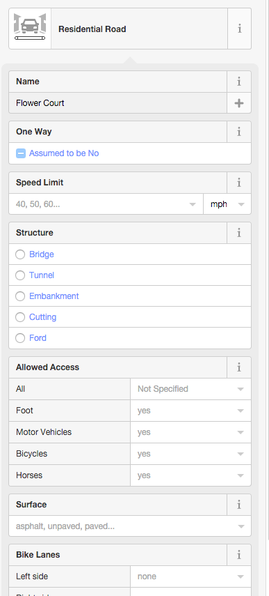
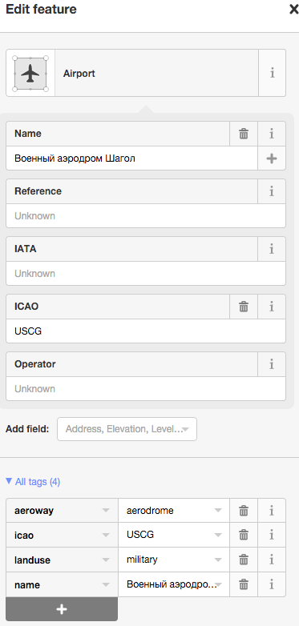

# P3: Wrangle OpenStreetMap data

Project for Data Analysis class.

## Tools used

To better explore the structure and what fields are available in data, I used an excellent `variety` tool here:

[https://github.com/variety/variety-cli](https://github.com/variety/variety-cli)

Otherwise, all queries were made with Mongo shell.

The repo with scripts used to clean the data and transform to JSON is here:

[https://github.com/j-bennet/udacity-nano-da-p3](https://github.com/j-bennet/udacity-nano-da-p3)

## 1. Problems encountered in dataset:

* Inconsistent punctuation.
* Abbreviated street names.
* Abbreviated (correctly and incorrectly) locality names.
* Abbreviated (correctly and incorrectly) train station designations.
* Incorrect or missing postcodes.

### Inconsistent punctuation

The following replacements were made to fix the problem:

 Text | Replacement | Explanation                                   
------|-------------|-----------------------------------------------
 `.`  | `. `        | Space inserted between dot and next character 
 `/`  | ` / `       | Spaces inserted around slash                  
 `«`  | `"`         | Left quotation replaced with straight
 `»`  | `"`         | Right quotation replaced with straight
 `№`  | ``          | Number signs stripped out as unnecessary

### Abbreviated street names

The following replacements were made:

 Text  | Replacement | Explanation                                   
-------|-------------|-----------------------------------------------
 `ул.` | `улица`     | Equivalent of "st." to "street" 
 `уч.` | `участок`   | Equivalent of "pl." to "place" 
 `уч-k`| `участок`   | Same as above
 
### Abbreviated locality names

The following replacements were made:

 Text  | Replacement | Explanation                                   
-------|-------------|-----------------------------------------------
 `ул.` | `улица`     | Equivalent of "st." to "street" 
 `уч.` | `участок`   | Equivalent of "pl." to "place" 
 `уч-k`| `участок`   | Same as above
 `п.`  | `поселок`   | Equivalent of "v." to "village" 
 `с.`  | `село`      | Same as above
 `д.`  | `деревня`   | Same as above
 `обл.`| `область`   | Equivalent of "r." to "region"
 `сдт.`| `садоводческое товарищество` | Equivalent of "fnc" to "farming non-profit community"
 `снт.`| `садоводческое товарищество` | Same as above
 `СНТ.`| `садоводческое товарищество` | Same as above
 
### Abbreviated train station designations

All these abbreviations were standardised to a single form.

 Text    | Replacement | Explanation                                   
---------|-------------|-----------------------------------------------
 `ж.д.`  | `ж/д`       | Changed to the most commonly accepted "railway" abbreviation
 `ж. д.` | `ж/д`       | Same as above
 `ж.д.`  | `ж/д`       | Same as above
 `ж.-д.` | `ж/д`       | Same as above
 `ж\д`   | `ж/д`       | Same as above
 `ж.\д.` | `ж/д`       | Same as above
 
### Postcodes

There were a few incorrect postcodes within the data:
 
```
> db.chelyabinsk.aggregate([
...     {$match: {"address.street": {$exists: 1}, "address.postcode": /[^0-9]/}},
...     {$group: {"_id": {"postcode": "$address.postcode"}, "count": {$sum: 1}}},
...     {$sort: {"count": -1}}
... ])
{ "_id" : { "postcode" : "<different>" }, "count" : 3 }
{ "_id" : { "postcode" : "<различные>" }, "count" : 2 }
{ "_id" : { "postcode" : "15/3" }, "count" : 1 }
```

I only looked within data that has "address.street" populated, because it would make sense for those nodes to also have postcodes.

There were also missing postcodes:

```
> db.chelyabinsk.aggregate([
...     {$match: {"address.street": {$exists: 1}, "address.postcode": {$exists: 0}}},
...     {$group: {"_id": {"postcode": "$address.postcode"}, "count": {$sum: 1}}},
...     {$sort: {"count": -1}}
... ])
{ "_id" : { "postcode" : null }, "count" : 11164 }
```

Here as well, since we have the address, postcodes should be known.

## Data overview

This section contains basic statistics about the dataset and the MongoDB queries used to gather them.

### File sizes

```
165M ...... chelyabinsk.osm
186M ...... chelyabinsk.osm.json
```

### Number of documents

```
> db.chelyabinsk.find().count()
906632
```

### Number of nodes

```
> db.chelyabinsk.find({type: "node"}).count()
801884
```

### Number of ways

```
> db.chelyabinsk.find({type: "way"}).count()
104627
```

### Number of unique users

```
> db.chelyabinsk.distinct("created.user").length
359
```

### Top 1 contributing user

```
> db.chelyabinsk.aggregate([{$group: {"_id": "$created.user", "count": {$sum: 1}}}, {$sort: {"count": -1}}, {$limit: 1}])
{ "_id" : "OlegV", "count" : 249809 }
```

### Number of users having only 1 post

```
> db.chelyabinsk.aggregate([
...     {$group: {"_id": "$created.user", "count": {$sum: 1}}},
...     {$sort: {"count": 1}},
...     {$group: {"_id": "$count", "users": {$sum: 1}}},
...     {$match: {"_id": 1}}
... ])
{ "_id" : 1, "users" : 51 }
```

## Additional statistics

### Speed limits on the roads (where set)

```
> db.chelyabinsk.aggregate([
...     {$match: {type: "way", maxspeed: {$exists: true}}},
...     {$group: {"_id": "$maxspeed", "count": {$sum: 1}}},
...     {$sort: {"count": -1}},
... ])
{ "_id" : "60", "count" : 1300 }
{ "_id" : "90", "count" : 378 }
{ "_id" : "20", "count" : 242 }
{ "_id" : "10", "count" : 222 }
{ "_id" : "40", "count" : 51 }
{ "_id" : "110", "count" : 14 }
{ "_id" : "5", "count" : 12 }
{ "_id" : "30", "count" : 4 }
{ "_id" : "60;40;60", "count" : 2 }
{ "_id" : "70", "count" : 1 }
{ "_id" : "50", "count" : 1 }
{ "_id" : "40;60", "count" : 1 }
```

Mostly it's 60km/h makes sense.

### Roads marked as attraction

```
> db.chelyabinsk.find({type: "way", attraction: {$exists: true}}, {_id: 0, name: 1, attraction: 1}).pretty()
{ "attraction" : "carousel" }
{ "name" : "Аттракцион Везунчики", "attraction" : "carousel" }
{ "attraction" : "carousel" }
{ "name" : "Аттракцион Кенгуру", "attraction" : "bungee_jumping" }
{ "attraction" : "bumper_car" }
{ "attraction" : "pirate_ship" }
{ "name" : "Аттракцион Дикий поезд", "attraction" : "roller_coaster" }
{ "name" : "Веселый поезд", "attraction" : "carousel" }
{ "name" : "Контактный зоопарк", "attraction" : "animal" }
```

### Nodes marked as attraction

```
> db.chelyabinsk.find({type: "node", attraction: {$exists: true}}, {_id: 0, name: 1, attraction: 1}).pretty()
{ "attraction" : "big_wheel" }
```

### Most common amenity types

```
> db.chelyabinsk.aggregate([
...     {$match: {"amenity": {$exists: true}}},
...     {$group: {"_id": "$amenity", "count": {$sum: 1}}},
...     {$sort: {"count": -1}}
... ])
{ "_id" : "parking", "count" : 728 }
{ "_id" : "kindergarten", "count" : 460 }
{ "_id" : "fuel", "count" : 327 }
{ "_id" : "school", "count" : 261 }
{ "_id" : "atm", "count" : 190 }
{ "_id" : "bank", "count" : 123 }
{ "_id" : "hospital", "count" : 122 }
{ "_id" : "cafe", "count" : 121 }
{ "_id" : "pharmacy", "count" : 108 }
{ "_id" : "car_wash", "count" : 78 }
{ "_id" : "telephone", "count" : 55 }
{ "_id" : "waste_basket", "count" : 54 }
{ "_id" : "fast_food", "count" : 53 }
{ "_id" : "public_building", "count" : 53 }
{ "_id" : "police", "count" : 47 }
{ "_id" : "college", "count" : 47 }
{ "_id" : "place_of_worship", "count" : 41 }
{ "_id" : "university", "count" : 40 }
{ "_id" : "toilets", "count" : 39 }
{ "_id" : "fountain", "count" : 39 }
```

### Religions

```
> db.chelyabinsk.aggregate([{$match: {"amenity": "place_of_worship"}}, {$group: {"_id": "$religion", "count": {$sum: 1}}}, {$sort: {"count": -1}}])
{ "_id" : "christian", "count" : 28 }
{ "_id" : null, "count" : 8 }
{ "_id" : "muslim", "count" : 5 }
```

### Cuisines

```
> db.chelyabinsk.aggregate([
...     {$match: {"cuisine": {$exists: 1}}},
...     {$group: {"_id": "$cuisine", "count": {$sum: 1}}},
...     {$sort: {"count": -1}}
... ])
{ "_id" : "pizza", "count" : 12 }
{ "_id" : "regional", "count" : 10 }
{ "_id" : "sandwich", "count" : 9 }
{ "_id" : "international", "count" : 7 }
{ "_id" : "sushi", "count" : 5 }
{ "_id" : "japanese", "count" : 2 }
{ "_id" : "burger", "count" : 2 }
{ "_id" : "coffee_shop", "count" : 1 }
{ "_id" : "italian", "count" : 1 }
{ "_id" : "spanish", "count" : 1 }
{ "_id" : "Русская", "count" : 1 }
{ "_id" : "east", "count" : 1 }
{ "_id" : "пельмення-кулинария", "count" : 1 }
```

### Aeroways and airports

```
> db.chelyabinsk.aggregate([
...     {$match: {"aeroway": {$exists: 1}}},
...     {$group: {"_id": "$aeroway", "count": {$sum: 1}}},
...     {$sort: {"count": -1}}
... ])
{ "_id" : "taxiway", "count" : 16 }
{ "_id" : "aerodrome", "count" : 6 }
{ "_id" : "runway", "count" : 4 }
{ "_id" : "helipad", "count" : 4 }
{ "_id" : "terminal", "count" : 1 }
{ "_id" : "apron", "count" : 1 }
```

Looks like we have some runways and taxiways there. Let's see airports only. Nodes are airport pins, and ways are airport enclosing polygons.

```
> db.chelyabinsk.find(
...     {"type": "node", "aeroway": "aerodrome"},
...     {_id: 0, name: 1, type: 1, type_tag: 1, landuse: 1, closest_town: 1, iata: 1, icao: 1, "created.user": 1}
... ).sort({name: 1})
{ "name" : "Аэродром Калачёво", "created" : { "user" : "vespex" }, "type" : "node" }
{ "name" : "Аэродром Шагол", "created" : { "user" : "glebius" }, "closest_town" : "Chelyabinsk", "icao" : "USCG", "type_tag" : "joint", "type" : "node" }
{ "name" : "Аэропорт Баландино", "created" : { "user" : "OlegV" }, "iata" : "CEK", "closest_town" : "Chelyabinsk", "icao" : "USCC", "type_tag" : "public", "type" : "node" }

> db.chelyabinsk.find(
...     {"type": "way", "aeroway": "aerodrome"},
...     {_id: 0, name: 1, type: 1, type_tag: 1, landuse: 1, closest_town: 1, iata: 1, icao: 1, "created.user": 1}
... ).sort({name: 1})
{ "name" : "Аэродром Калачево", "created" : { "user" : "Shoorick" }, "closest_town" : "Chelyabinsk", "type_tag" : "public", "type" : "way" }
{ "name" : "Аэропорт Баландино", "created" : { "user" : "Shoorick" }, "iata" : "CEK", "closest_town" : "Chelyabinsk", "icao" : "USCC", "type_tag" : "public", "type" : "way" }
{ "name" : "Военный аэродром Шагол", "created" : { "user" : "Screenshot" }, "icao" : "USCG", "landuse" : "military", "type" : "way" }
```

## Conclusion

Despite some inconsistencies in how addresses were entered (abbreviations, punctuations and such), the data 
submitted to OpenStreetMap seems in pretty good shape. Missing data is a bigger problem. A lot of zipcodes (postal codes)
are absent for known addresses. A lot of data points only have basic information specified about them. For example, schools
and kindergartens don't have a grade designation. Very few amenities have schedule information (open / close hours).

There is some inconsistency in node vs area naming. For example, if you look at one of the airports above, node is named "Аэродром Шагол",
while way is named "Военный аэродром Шагол", even though it is the same airport. Node and way were entered by different users. Also, words
"аэродром" (aerodrome) and "аэропорт" (airport) should not really be used interchangeably, but it looks like they are.

However that may be, OpenStreetMap users made an amazing effort to collect all this data. The problems 
encountered in the data could be eradicated by improving the UI of tools used for data entry, which are
often not very user-friendly and have too many free-form, confusing options.

## Possible ways to improve

I'm going to look at two UI examples here. Both of them are using `id` online editor in OpenStreetMap. 

### 1. Adding a road

The editor itself is quite advanced. When you add the line to the map, there is a side window
with lots of features you can assign to this line.

First, you choose this line type. This field is in fact very helpful, because it's enhanced with
search-as-you-type feature, no complaints there.

Second, you enter road name. Here, it would be great to have 2 fields side-by-side, a drop-down
for the road type that would have choices ("Road", "Street", "Court", "Boulevard") and a text 
entry field for the name itself. Also, once you click on the field, it would be great to show
examples of expected values, in an info bubble. For our example here, when we already know that
user is entering a road, we could show something like this:
 
```
Enter the name of your street, without quotation mark or punctuation: Example:
Martin Luther King
Broadway
Main

Select the type of your street from the drop-down. Example:
Road
Street
Avenue
```



In current OSM editor, while there's an "i" information icon next to the "name" field, the information it 
displays is not very helpful. It only says that this is "The primary tag used for naming an element". I
assume this is generic "name" tag description of any XML element. But it could be tailored to fit the
element type.

### 2. Editing an airport area



When I add an area and it encloses an already existing pin, it may make sense to auto-fill the area
name and make it the same as the pin. Especially in our example, when we first created an "Airport terminal"
node, and then drew an "Airport" area around it. They are both airport-related types, so we could assume
user is creating an area for an already existing node. However, the "name" field didn't pick up the name from
the terminal node. So we ended up with "Аэродром Шагол" for an airport node, and "Военный аэродром Шагол"
for an airport area.

Also, the word "аэродром" (aerodrome) could have been prevented by suggesting "airport" instead,
either in an "info bubble", or some other type of message.

## Possible problems when suggestions implementation

I believe that these suggestions could help to standardize and clean the data entered by users,
get rid of excessive or incorrect punctuations, and unify names or abbreviations. But it's no silver
bullet. A lot of people don't bother to read the tips, even if the pop-up is hovering right there.
Also, if the interface becomes too restrictive, for example, user want to select "Court", and our drop-down
only has "Street", "Road" and "Avenue", user may get frustrated and abandon the data entry.
So even when adding multiple choice fields, we should have an option to select "Other..." and revert to
free-form.

Also, dynamic pages, context-dependent controls, and other flexibility features of the UI add complexity
to the website development. This translates to more human-hours to develop and support. There's
possibility of more bugs in complex interface. There's more edge cases to keep in mind. Performance
may become an issue. Thus, we always have to find the balance and make the tool smart, but not
too complex.