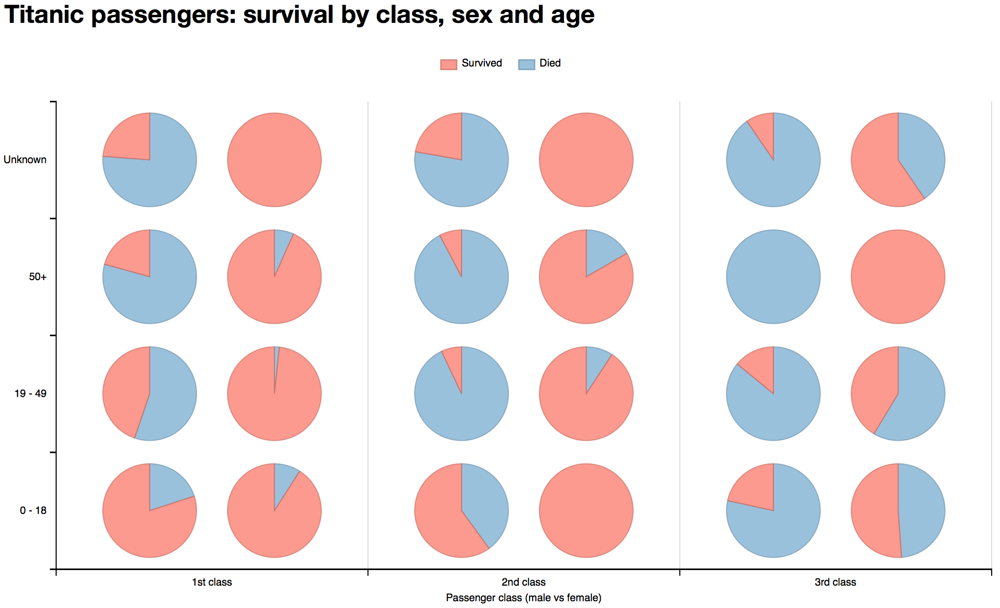
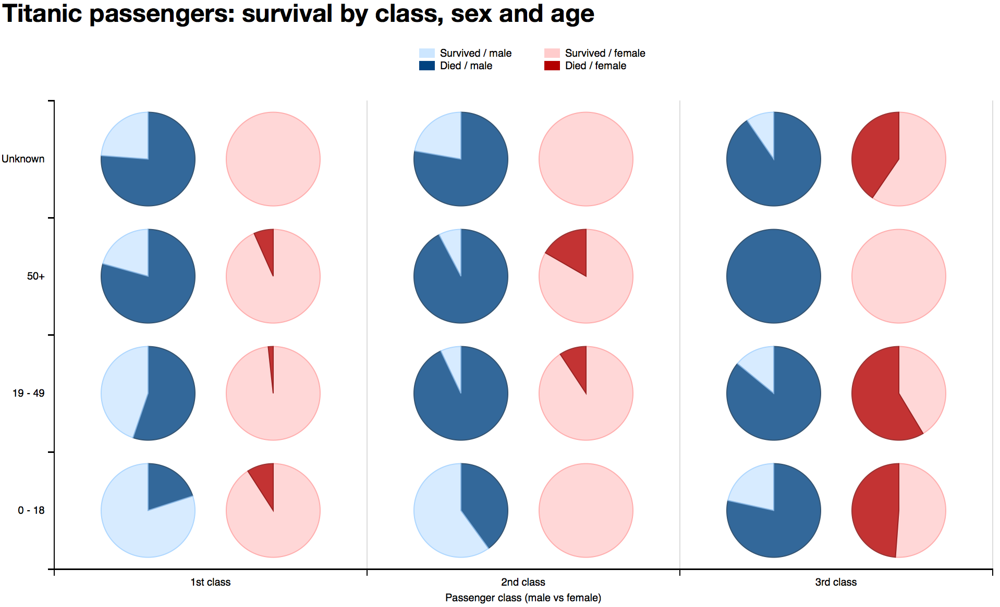
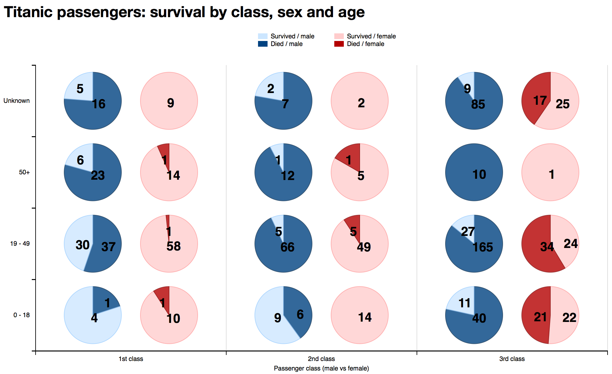
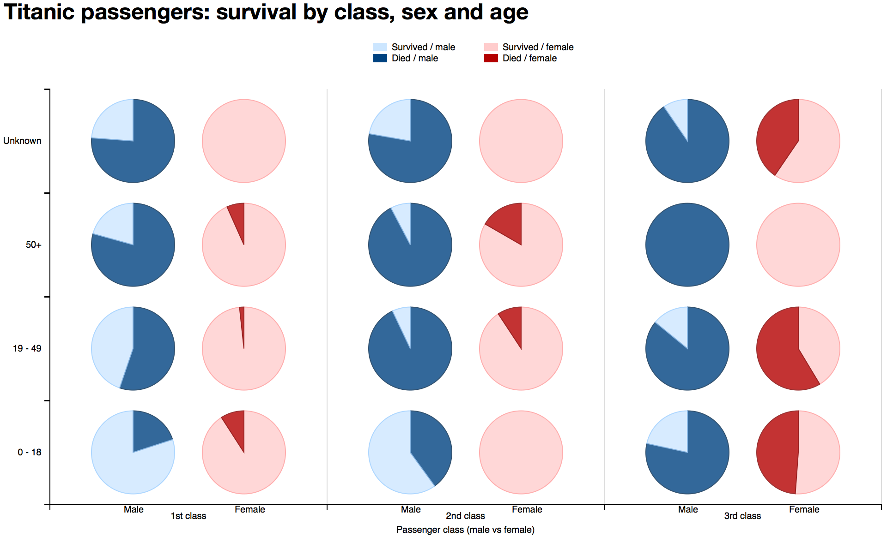

# Summary

Here is the the [interactive version](http://bl.ocks.org/j-bennet/raw/219cf6b3cebc5b93a310308c64231cc6/)
with tooltips that have additional information about chart elements.

This visualization shows survival on Titanic, depending on three factors:
 
* Passenger class
* Sex
* Age

On X axis, we have passenger class, and male vs female within each
class.

On Y axis, we have the age group.

Survivors are plotted in lighter color, and the ones who didn't make it
in darker color. Blue for males, red for females.

# Design

The data was transformed to first place each passenger into one of the
age groups as follows:

1. 0 - 18 years old (children)
2. 19 - 49 years old (adults)
3. 50 and up (older people)
4. Unknown.

Then, passengers were grouped by:

* Class
* Sex
* Age group
* Survival.

Initially, I tried bubble chart, and used number of people in each group
to size the bubbles. However, most of the passengers fall into the group
from 19-49 years old in 3rd class. Then that one bubble becomes very
large, and the rest of them are very small in comparison, and it's not
easy to see ratio of survival in each group.

After that, I chose pie chart to display the groups, and gave them all a
fixed size. This way, it's easier to see which groups were the luckiest.

## Version 1

# Feedback on version 1

* Red associated with "good" and blue with "bad" is counter-intuitive.
* It took a while to spot that there are two columns of pies in
  each passenger class to represent males and females. Maybe adding
  different border colors like Pink vs Blue or adding an icon next to
  the pie charts could help.

## Version 2

# Feedback on version 2

* Because you can't see absolute numbers on chart (unless you hover over),
  it's hard to tell which groups are more representative of a tendency,
  and which are not. For example, all females of age 50+ in third class
  survived, which seems to go against the tendency. But then, this group
  only contains one person, so it is not really representative.

# Feedback on version 3

* Chart colors can confuse the reader, at the first sight, it looks like 
  blue is survived and red is not survived, however, it is just 
  male/female categories. My suggestion is to use the same coloring 
  for male/female (as in the first version) but add additional signs
  in the X-axis about gender.
* Numbers inside chart - the formatting looks a bit strange, so I 
  would suggest removing them, the viewer can explore them inside
  tooltips.
  
# Version 4

For version 4, please use the [interactive version](http://bl.ocks.org/j-bennet/raw/219cf6b3cebc5b93a310308c64231cc6/)
that has tooltips when you hover over elements. Static snapshot is here:

I decided to act upon the suggestion of removing the numbers, but not to
take the suggestion of reverting back to same colors for male/female.
I think that as this has been a matter of some opinions (first reviewer
suggested using different colors to differentiate between sexes), there
will be people liking v1 and people liking v2. Personally I think that
blue / pink is a common characteristic to male/female.

I also implemented a suggestion of adding marks for male/female to X axis,
so they serve as an addition to male/female colors and hopefully prevent the
confusion.

# Visualizaion takeaways

* Chances of survival are highest in the 1st class and worst in 3rd class.
* Throughout all the classes and age groups, female survival is higher than male.
* Chances of survival also drop with age, which is consistent in all classes
  and sexes, except females over 50 in 3rd class. But then, that group only
  consists of one person and is not therefore a good representation.

#  Resources

* http://dimplejs.org/examples_index.html
* https://github.com/mbostock/d3/wiki
* http://stackoverflow.com/questions/25774821/dimple-js-axis-labels
* http://www.d3noob.org/2014/02/grouping-and-summing-data-using-d3nest.html
* http://stackoverflow.com/questions/28306308/how-to-draw-labels-on-dimple-js-donut-or-pie-chart
